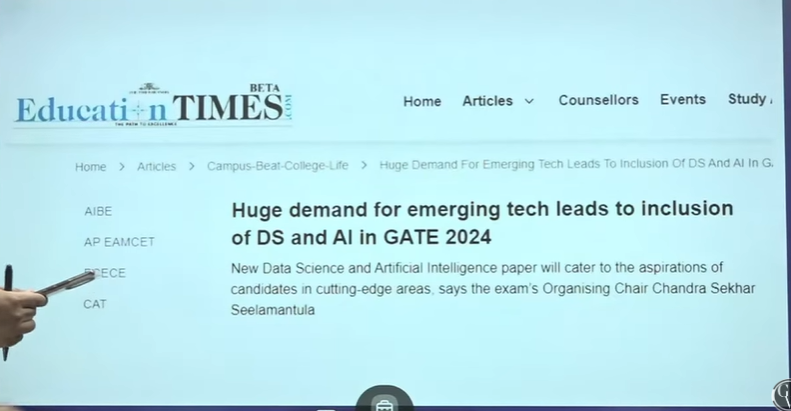
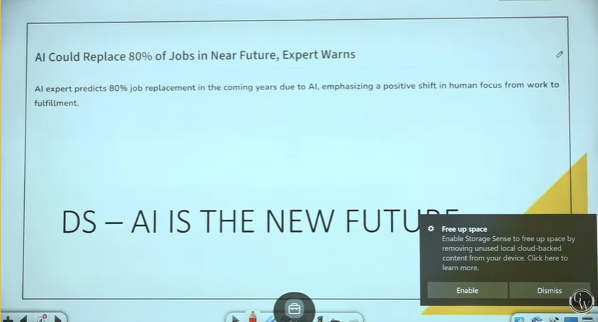
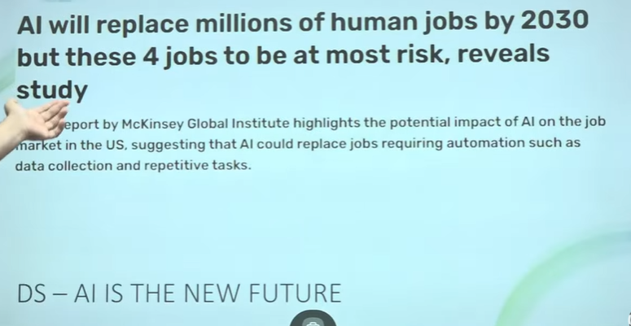
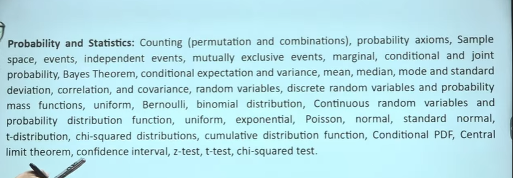

# Machine Learning 01 | DS & AI | Why So Many Students Attempt GATE DS AI Exam | GATE 2025 Series

> Btech in DS/AI is new stream(in 2024). No one is graduated till now
> who can give exam - EE/EC/CS/IN/CE/CH/ME
> why all branches can crach DS/AI paper?
> Almost 75% Mathematics and 25% is 1-2 subjects of CS  
> If you fill demand then only you get good placement

> AI could replace 80% of Jobs in Near future, Experts Warns
    > Only Top-notch coders will be required.

> B.tech significance is low now and M.tech is significant is increased
> DS-AI is the new future 

> VLSI is the new future branch
> CS/IT and DS-AI
> Other such as Renewable energy, Electic Vehicles  

## Syllabus

* Subject 1 - Probability and Statistics and Random Variables - It is Pure Mathematics.
    * You read above in College Engineering Mathematics
    * Only few topics at last line are not in engineering maths
* Subject 2 - Linear Algebra
    * It is pure Maths
* Subject 3 - Calculus and Optimization
    * It is pure Maths
* Subject 4 - It is CS subject
    * Programming, Data structures and Algorithms
    * This you study in College
* Subject 5 - Database Management and Warehousing
    * It is bit new and can easily be covered
* Subject 6 - Machine Learning
    * It is simply extended version of Mathematics
    * > My Mtech final paper was in support paper, fuzzy paper, Ant colonization - Neural network
    * Just apply little brain and it's very easy
    * You will find everything new while studying
    * > I will be teaching Machine learning and artificial intelligence
    * > Sir what about Question paper reference ?
    * > I will refer NPTEL assignment for the level
    * > 2 university - I will refer MIT courses assignments and Standford assignments. And also Berkeley
    * We won't go into Hi-Fi. Till 2025 and 2026 it will be easy
* Subject 7 - Artificial Intelligence
    * It's syllabus is bit short
    * This time question only came from Machine learning only(2024)
    * It is also mathematics

* So total we have 7 subjects
    * 3 are core maths
    * ML and AI
        * These are new for everyone
    * DBMS and DS
        * DBMS is bit strange. you will need to put an effor for this

* > Our Motive is we want to remove fear of ML and AI
* > Already you have done Probability by Puneet Sir
    * If you know Linear Algebra , I will also do linear algebra
    * I will do a FULL COURSE ON MACHINE LEARNING
    * If you have idea about Matrix and transpose, we will also do little recall.
    * Basic Prerequisite - 
        * Probability. Later it will be required more
        * Little Linear Algebra
        * We will do questions as well
        * We will try to cover each corner of this subject
        * It will take one month
        * 6-8 PM  
* If you want to switch from your core branch to something else then DS-AI is the best for your future

