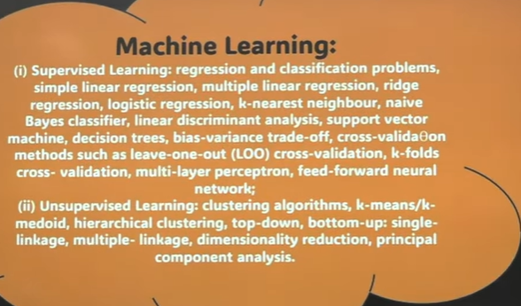
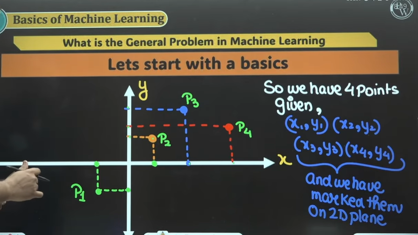
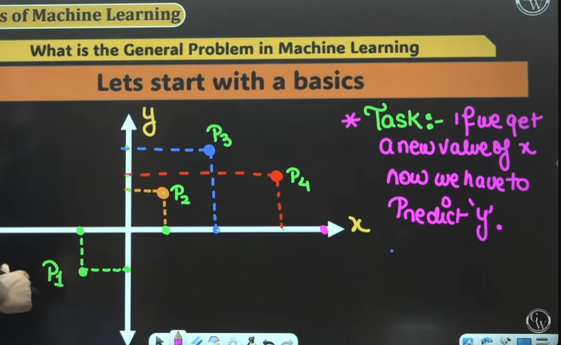

# Machine Learning 03 | Basic Introduction | DS & AI | GATE 2025 Series

## Syllabus

## Prerequisites
* Mathematics(Linear Algebra)
* Mathematics(Probability)
* Mathematics(Basic Calculus)

> "Your positive action combined with positive thinking results in success"  

## Basics of Machine Learning

What is the General Problem in Machine Learning

Lets start with a basics  

